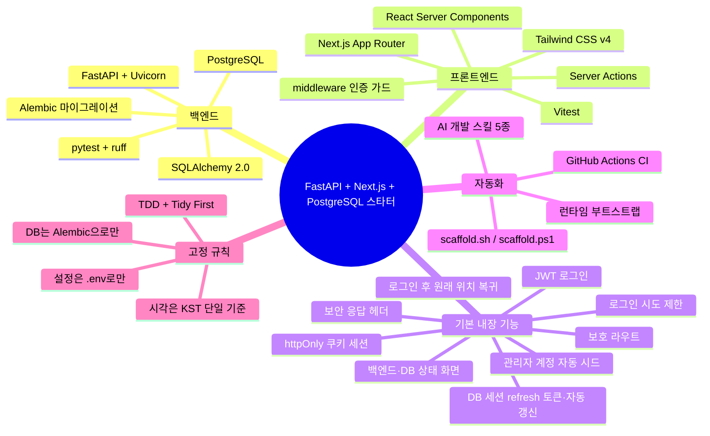
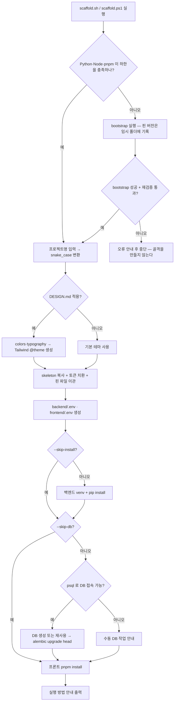
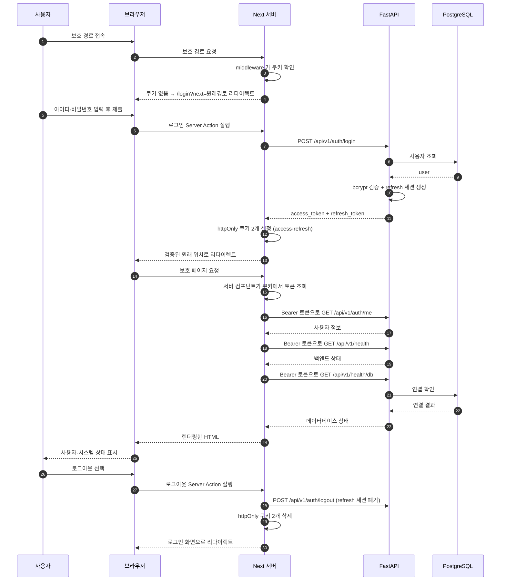
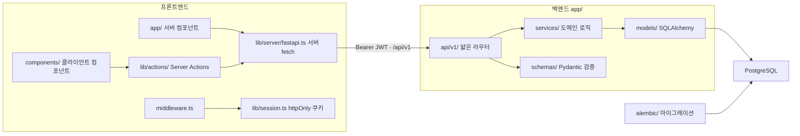

# FastAPI + Next.js + PostgreSQL 프로젝트 스타터 템플릿

신규 프로젝트를 **스크립트 한 번**으로 만든다.
생성물의 기준(아키텍처·룰)의 원본(SSOT)은 이 폴더다.

```
fastapi-nextjs-pg-starter/
├── scaffold.ps1            # ★ Windows (PowerShell) 스캐폴드
├── scaffold.sh             # ★ macOS / Linux (bash) 스캐폴드 — 동작 동일
├── DESIGN.md               # 디자인 토큰(색상/타이포) — 선택적으로 테마에 반영
├── LICENSE                 # MIT
├── .github/workflows/      # 이 템플릿 저장소 자체의 CI
├── README.md               # (이 파일)
└── skeleton/               # 새 프로젝트가 받는 골격 전체
    ├── CLAUDE.md           # 프로젝트 AI 개발 지침 (선택)
    ├── PLAN.md             # TDD 작업 계획
    ├── README.md
    ├── .python-version / .nvmrc      # 런타임 핀
    ├── .gitignore / .gitattributes
    ├── .github/workflows/ci.yml      # 생성된 프로젝트의 CI
    ├── docs/architecture.md          # 공통 아키텍처 가이드 (상세 기준)
    ├── scripts/            # bootstrap.sh / bootstrap.ps1 / versions.env
    ├── backend/            # FastAPI + SQLAlchemy + Alembic + pytest
    └── frontend/           # Next.js App Router + React + TS + Tailwind v4 + 서버 컴포넌트/Server Actions
```

## 한눈에 보기

### 무엇이 들어 있나



### 스크립트 한 번으로 무슨 일이 일어나나



> `--skip-db`·`--skip-install` 은 해당 단계만 건너뛴다.
> **런타임 사전 검사와 bootstrap 선행 실행은 두 옵션으로 생략되지 않는다.**

### 만들어진 앱이 실제로 도는 모습



> 브라우저는 Next 서버하고만 통신한다. FastAPI 호출과 Bearer JWT 주입은 서버 컴포넌트 또는
> Server Action에서 수행하며, 세션 토큰은 브라우저 JavaScript가 읽을 수 없는 httpOnly 쿠키에 둔다.
> access 쿠키(기본 15분)가 만료되면 `middleware.ts`가 refresh 쿠키(기본 14일, DB 세션 기반 회전)로
> 새 토큰 쌍을 받아 재로그인 없이 세션을 잇는다.

### 요청이 흐르는 계층



> 계층 규칙: 라우터는 HTTP 만 얇게, 도메인 로직은 `services/`, 검증은 `schemas/`.
> 프론트의 조회는 서버 컴포넌트, 변경은 Server Actions가 담당하고 FastAPI 통신은 서버 전용 fetch 래퍼로 모은다.
> 상세는 [`skeleton/docs/architecture.md`](skeleton/docs/architecture.md).

## 사용법 — OS별 스크립트

> 저장소를 clone 하거나 fork 한 뒤 템플릿 루트에서 자신의 OS 에 맞는 스크립트를 실행한다.
> 두 스크립트는 같은 `skeleton/`·`DESIGN.md` 를 사용하므로 어느 OS에서 만들어도 결과가 동일하다.

> **생성 위치(`-Target`/`--target`)를 지정하지 않으면** 이 템플릿 폴더의 **부모 폴더에 프로젝트명으로** 생성된다.
> 예: `work/fastapi-nextjs-pg-starter/` 에서 `MyProject` 를 입력하면 → `work/MyProject/` 에 생성.
> (대화형일 땐 기본값을 보여주고 Enter 로 수락)

### Windows (PowerShell) — `scaffold.ps1`

```powershell
# 대화형 (이름/위치/DB정보/DESIGN 적용여부를 물어봄)
.\scaffold.ps1

# 인자 지정
.\scaffold.ps1 -Name MyProject -Target C:\work\MyProject

# 골격만 빠르게 (DB·설치 생략)
.\scaffold.ps1 -Name MyProject -Target .\MyProject -SkipDb -SkipInstall
```

### macOS / Linux (bash) — `scaffold.sh`

```bash
chmod +x scaffold.sh          # 최초 1회 (실행 권한이 없을 때)

# 대화형
./scaffold.sh

# 인자 지정
./scaffold.sh --name MyProject --target ~/work/MyProject

# 골격만 빠르게
./scaffold.sh --name MyProject --target ./MyProject --skip-db --skip-install
```

| PowerShell | bash |
|-----------|------|
| `-Name` `-Target` | `--name` `--target` |
| `-SkipDb` `-SkipInstall` | `--skip-db` `--skip-install` |
| `-Design` `-NoDesign` | `--design` `--no-design` |
| `-DbHost/-DbPort/-DbUser/-DbPassword/-DbName` | `--db-host/--db-port/--db-user/--db-password/--db-name` |
| (대응 스위치 없음) | `-h` `--help` |

### 스크립트가 하는 일 (전체 자동)

1. **런타임 사전 검사** → 하한 미달이면 bootstrap 실행 후 재검증, 실패하면 골격 복사 전에 중단
2. 이름/위치 입력 → `PascalCase` 를 `snake_case`(DB명·쿠키 이름 접두)로 변환
3. **DESIGN.md 적용 여부 질문** → 적용 시 `colors`/`typography` 를 Tailwind `@theme` 로 변환해
   `frontend/app/globals.css` 에 주입(+`docs/DESIGN.md` 복사)
4. `skeleton/` 복사 + 토큰 치환(`__PROJECT_NAME__`, `__PROJECT_SNAKE__`, 테마) + 런타임 핀 파일 이관
5. **PostgreSQL 접속정보 질문** → `backend/.env`·`frontend/.env` 생성(`DATABASE_URL`·`SECRET_KEY`·`FASTAPI_URL` 주입)
6. 백엔드: `python -m venv .venv` + `pip install -r requirements.txt`
7. **psql 로 DB 생성** → **Alembic `upgrade head` 로 테이블 생성**(DB는 항상 Alembic으로 관리 §11)
8. 프론트: `pnpm install`
9. 실행 방법(`uvicorn`, `pnpm dev`) 출력

### 옵션 플래그

| 플래그 | 효과 |
|--------|------|
| `-SkipDb` | psql DB 생성 + alembic 마이그레이션 생략 |
| `-SkipInstall` | venv/pip + pnpm install 생략 |
| `-Design` / `-NoDesign` | DESIGN.md 적용 강제 / 미적용 (질문 생략) |
| `-DbHost/-DbPort/-DbUser/-DbPassword/-DbName` | DB 접속정보 비대화형 지정 |

### 사전 요구사항 (PATH 에 있어야 함)

- Windows: `python` (3.13+), Node.js (24+), `pnpm` (11+), `psql` (PostgreSQL)
- macOS/Linux: `python3` (3.13+), Node.js (24+), `pnpm` (11+), `psql`
- 하한을 충족하면 **기존 설치본을 그대로 재사용**한다. pyenv·fnm 은 하한 미달일 때만 필요하다.
- `psql` 이 없거나 접속할 수 없으면 프로젝트 생성은 계속되고 수동 DB 명령이 출력된다.

## 생성 직후

1. 스크립트가 출력한 대로 백엔드(`uvicorn`)·프론트(`pnpm dev`)를 실행
2. 브라우저 <http://localhost:3000> → 랜딩 페이지에서 **백엔드·DB 연결 상태**가 "정상"이면 성공
3. 생성 프로젝트의 [`README.md`](skeleton/README.md)·[`docs/architecture.md`](skeleton/docs/architecture.md)·
   [`PLAN.md`](skeleton/PLAN.md) 를 읽고 TDD(Red→Green→Refactor)로 개발 시작

개발용 기본 관리자는 `admin` 이며, 비밀번호는 스캐폴드가 프로젝트마다 무작위로 생성해 `backend/.env` 의 `DEFAULT_ADMIN_PASSWORD` 에 넣고 완료 안내에 출력한다. 시드는 코드 기본값이 꺼져 있고(`SEED_DEFAULT_ADMIN=false`) 이 `.env` 에서만 켜진다.
**운영 배포 전에는** `SECRET_KEY` 교체, 기본 관리자 시드 비활성화 또는 비밀번호 변경,
로그인 화면의 기본 계정 안내 제거가 필요하다.
세부 항목은 [아키텍처 §21의 배포 전 체크리스트](skeleton/docs/architecture.md#21-신규-프로젝트-부트스트랩-체크리스트)를 확인한다.

## 기준이 바뀌면

- **원본만 수정**: `skeleton/docs/architecture.md`(+ 필요 시 `skeleton/CLAUDE.md`).
- `architecture.md` 상단의 **★ 핵심 MUST 요약**이 항상 최신 고정 규칙을 반영하도록 유지한다.
- 이미 생성한 프로젝트에는 템플릿 변경이 자동 동기화되지 않는다. 필요한 변경을 선택해 반영한다.

## 문제 해결

- 스캐폴드는 [`skeleton/scripts/versions.env`](skeleton/scripts/versions.env) 의 최소 버전과
  `.python-version`·`.nvmrc` 핀을 검사한다. 기준을 충족하지 않으면 OS별 bootstrap 을 실행하고
  다시 검증하며, 실패하면 **복사 전에 중단**한다.
- **이미 하한을 충족하는 런타임이 있으면 pyenv·fnm 없이도 진행된다.** 버전 관리자는 런타임이
  하한에 못 미칠 때만 필요하다.
- Windows 에서 **Python 이 하한 미달이고 pyenv-win 도 없으면** bootstrap 이
  [공식 pyenv-win 설치 문서](https://pyenv-win.github.io/pyenv-win/docs/installation.html)를 안내하고
  중단한다(자동 설치하지 않는다). 설치 후 **새 터미널**에서 다시 실행한다.
- pyenv 가 있어도 `.python-version` 에 핀된 버전을 내려받지 못하면(버전 DB 가 오래된 경우 등)
  하한을 충족하는 기존 Python 으로 진행하고 **핀 불일치를 경고**한다.
  CI 는 핀 파일을 읽으므로 로컬과 다른 버전을 쓰게 된다는 뜻이다.
- macOS/Linux 의 pyenv·fnm 설치에는 Homebrew 또는 지원되는 패키지 관리자가, Windows 의 fnm 설치에는
  winget 이 필요할 수 있다.
- 프론트 서버가 FastAPI에 연결하지 못하면 `frontend/.env`의 서버 전용 `FASTAPI_URL`과 백엔드 기동
  주소를 확인한다. 이 변수에 `NEXT_PUBLIC_` 접두사를 붙이면 브라우저 번들에 노출될 수 있다.

## 버전 고정 정책

영역마다 고정 방식이 다르다. 스캐폴드를 실행하기 전에 **런타임 하한**을 충족하는지만 확인하면 된다.

| 영역 | 고정 방식 | 값 | SSOT |
|---|---|---|---|
| 런타임 하한 | 이상이면 기존 설치본 재사용 | Python `≥ 3.13`, Node.js `≥ 24`, pnpm `≥ 11` | [`versions.env`](skeleton/scripts/versions.env) |
| 런타임 설치 핀 | pyenv·fnm·corepack 이 설치·활성화 | Python `3.13.14`, Node.js `24`(24.x 최신), pnpm `11.27.1` | [`.python-version`](skeleton/.python-version), [`.nvmrc`](skeleton/.nvmrc), `package.json` 의 `packageManager` |
| 백엔드 패키지 | `==` **정확 고정** (재현성 우선) | fastapi `0.141.1`, sqlalchemy `2.0.54` 등 13개 | [`requirements.txt`](skeleton/backend/requirements.txt) |
| 프론트엔드 패키지 | 런타임 4종은 `==` 정확 고정, TypeScript 는 `~`, 그 외 도구는 `^` | next `16.3.6`, react·react-dom `19.3.0`, eslint-config-next `16.3.6`, typescript `~6.0.3`, tailwindcss `^4.3.3`, vitest `^5.0.1` 등 | [`package.json`](skeleton/frontend/package.json), [`pnpm-lock.yaml`](skeleton/frontend/pnpm-lock.yaml) |
| PostgreSQL | 고정 없음 | `psycopg2-binary` 지원 범위(14+ 권장), CI 는 `postgres:16` | — |

패키지별 전체 목록은 [생성 프로젝트 README의 기술 스택과 버전](skeleton/README.md#기술-스택과-버전)에 있다.
백엔드는 임의 `pip install -U` 를 금지하며, 핀 상향은 `stack-versions` 스킬의 검증 절차
(임시 스캐폴드로 install·pytest·build 확인)를 따른다. 프론트 버전은 실제 install·lint·typecheck·test·build가
모두 통과하고 배포 후 24시간이 지난 조합만 확정한다.

## 템플릿 커스터마이즈

- 생성물의 코드·설정·문서 원본은 [`skeleton/`](skeleton/) 에서 수정한다.
- 공통 디자인 토큰은 [`DESIGN.md`](DESIGN.md), 기본 설계 규칙은
  [`skeleton/docs/architecture.md`](skeleton/docs/architecture.md), 작업 계획은
  [`skeleton/PLAN.md`](skeleton/PLAN.md) 에서 관리한다.
- [`skeleton/CLAUDE.md`](skeleton/CLAUDE.md) 와 `add-backend-domain`·`db-migration`·
  `add-frontend-feature`·`pr-workflow`·`stack-versions` [스킬](skeleton/.claude/skills/)은
  저장소 안의 규칙을 AI 개발 도구에서 활용하도록 돕는다. 다만 스캐폴드 생성, 애플리케이션 실행,
  테스트와 CI 는 이 파일들 없이도 동작한다.

## 검증 상태

아래는 macOS(Darwin 25.5, Python 3.13.14 / Node 24.18.0 / pnpm 11.9.0)에서
`scaffold.sh` 로 실제 프로젝트를 생성하고 백엔드·프론트를 함께 띄워 확인한 결과다.

**통과 확인함**

- 스캐폴드: `--skip-db --skip-install --no-design` / `--design` 양쪽 exit 0.
  생성물에 `__PROJECT_NAME__` · `__PROJECT_SNAKE__` · `__THEME_CSS__` 잔재 없음
- 토큰 치환: `app/layout.tsx` 의 metadata `title` = `MyProject`,
  `frontend/package.json` `name` = `my_project-frontend`,
  `lib/session.ts` `SESSION_COOKIE` = `my_project_session`,
  `frontend/.env` = `FASTAPI_URL=http://localhost:8000`,
  `backend/.env` 의 `CORS_ORIGINS`·`FRONTEND_URL` = `http://localhost:3000`
- 테마: `--no-design` 은 기본 12토큰 `@theme`, `--design` 은 DESIGN.md 의 색상
  (`--color-primary: #00478d` 등 전체 팔레트)이 `frontend/app/globals.css` 에 주입되고
  `docs/DESIGN.md` 가 복사됨
- 백엔드: `pip install -r requirements.txt` + `ruff check .` (All checks passed) +
  `pytest -q` (35건 통과). 테스트는 `.env` 의 `DATABASE_URL` 과 무관하게 SQLite 픽스처를 쓴다
- Alembic: SQLite 기준 `upgrade head` (0001_initial → 0002_users, `app_meta`·`users` 테이블) exit 0
- 프론트: `pnpm install` · `pnpm lint` · `pnpm typecheck` · `pnpm test`(2파일 13건) · `pnpm build`
  다섯 개 모두 exit 0. `pnpm install` 이 `pnpm-workspace.yaml` 을 수정하지 않는 것도 해시 비교로 확인했고
  (`allowBuilds` 맵 사용), `ERR_PNPM_IGNORED_BUILDS` 경고도 나오지 않는다
- **서버 전용 코드가 클라이언트 번들로 새지 않음**: `pnpm build` 산출물의 `.next/static/` 전체에서
  `FASTAPI_URL` · `localhost:8000` · `:8000` · 세션 쿠키 이름(`my_project_session`) 이 **0건**.
  해당 문자열은 `.next/server/` (SSR 청크)에만 존재한다 — 내부 API 주소와 세션 토큰은
  브라우저로 내려가는 자바스크립트에 포함되지 않는다
- Tailwind v4 유틸리티 생성: 산출 CSS 에 `bg-surface-container-lowest`,
  `text-on-surface-variant`, `bg-tertiary-container`, `bg-error-container`,
  `text-on-error-container`, `border-outline-variant`, `disabled:opacity-60`
  (`.disabled\:opacity-60:disabled{opacity:.6}`) 모두 실제로 생성됨
- 구동(SQLite + `uvicorn` + `next start` 프로덕션 빌드, 다른 프로세스와 겹치지 않는 포트 사용):
  - `GET /api/v1/health` → `{"status":"ok"}`
  - 기본 관리자 시드(`admin` + 무작위 비밀번호) 로그인 → access token 발급
  - 미인증 `GET /` → **307 → `/login?next=%2F`** (middleware 동작). `/landing`·`/my` 도 동일
  - `GET /login` → 200, 로그인 폼 HTML 반환 (middleware matcher 가 `/login` 을 제외해 루프 없음)
  - **Server Action 로그인을 curl 로 직접 검증**(progressive enhancement 폼 POST) →
    303 See Other + `Location: /my` + `Set-Cookie: my_project_session=…; HttpOnly; SameSite=lax`
  - 유효 세션 쿠키로 `GET /` → 200, HTML 에 `admin 님, 환영합니다`
  - `GET /landing` → 200, 스트리밍된 HTML 에 백엔드·데이터베이스 상태가 모두 `정상`
  - `GET /my` → 200, HTML 에 아이디 `admin` · 권한 `관리자`
  - **잘못된 쿠키**(가짜 토큰)로 `/`·`/my` 접근 → middleware 는 통과하지만 FastAPI 가 401 →
    `/login?next=…` 로 리다이렉트 (`getSessionUser` 의 401 처리). 백엔드 로그에 401 2건 확인
- **오픈 리다이렉트 방어**: `GET /login?next=https://evil.example` 과 `GET /login?next=//evil.example`
  모두 폼의 hidden `next` 값이 `/` 로 정규화됨. 정상 경로(`?next=/my`)는 그대로 보존됨

**참고 (동작에는 문제 없음)**

- `next build` 가 `middleware` 파일 규약이 deprecated 이며 `proxy` 로 옮기라는 경고를 낸다
  (Next.js 16.3.1). 빌드·동작은 정상이며 라우트 표에도 `ƒ Proxy (Middleware)` 로 표시된다.
- `next start` 는 `NODE_ENV=production` 이라 세션 쿠키에 `Secure` 가 붙는다. 브라우저는
  `http://localhost` 를 신뢰 출처로 취급해 문제가 없지만, curl 같은 클라이언트로 http 로
  테스트할 때는 쿠키가 저장되지 않으므로 쿠키를 직접 실어 보내야 한다.

**미검증**

- PostgreSQL 경로: `--skip-db` 로 검증했으므로 `psql` DB 생성과 PostgreSQL 상대
  `alembic upgrade head` 는 확인하지 못했다. 마이그레이션은 SQLite 로만 검증했다.
- `alembic downgrade base` 는 실행하지 않았다.
- `scaffold.ps1`(Windows/PowerShell): 실행 환경이 없어 검증하지 못했다. bash 판과 동일한
  `skeleton/`·`DESIGN.md` 를 사용하지만 결과 동일성은 확인되지 않았다.
- 스캐폴드의 자동 설치 단계(`--skip-install` 없이 실행)와 `bootstrap.sh` 의 런타임 설치 경로는
  거치지 않았다. 이미 기준을 만족하는 pyenv/fnm 런타임을 재사용했고 pip/pnpm 설치는 수동으로 확인했다.
- 브라우저 실제 렌더링(디자인 적용·콘솔 에러)은 확인하지 않았다. 검증은 전부 HTTP 레벨(curl)이다.
- `pnpm dev`(개발 서버) 경로는 사용하지 않았다. 구동 검증은 `pnpm build && pnpm start` 로 했다.
- 로그아웃 Server Action 은 별도로 호출해 보지 않았다.
- 위 검증 **이후**의 인증 개편(refresh 토큰·middleware 자동 갱신·로그인 스로틀·보안 응답 헤더,
  [CHANGELOG](CHANGELOG.md) 참조)에 대해서는 이 절차의 끝-대-끝 재검증을 반복하지 않았다.
  당시 확인한 쿠키 이름 상수도 이후 `lib/session.ts` 에서 `lib/session-cookie.ts` 로 옮겨졌다.

## 라이선스와 기여

이 프로젝트는 [MIT License](LICENSE)로 배포된다.
변경 이력은 [`CHANGELOG.md`](CHANGELOG.md)에서 확인할 수 있으며,
버그 수정이나 개선은 한 가지 목적에 집중한 이슈 또는 pull request 로 제안해 주세요.
