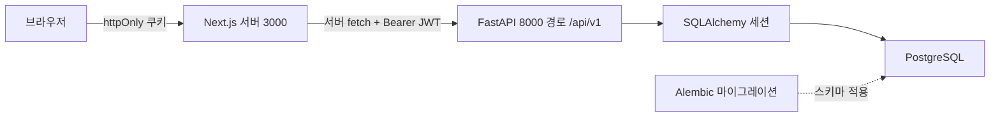
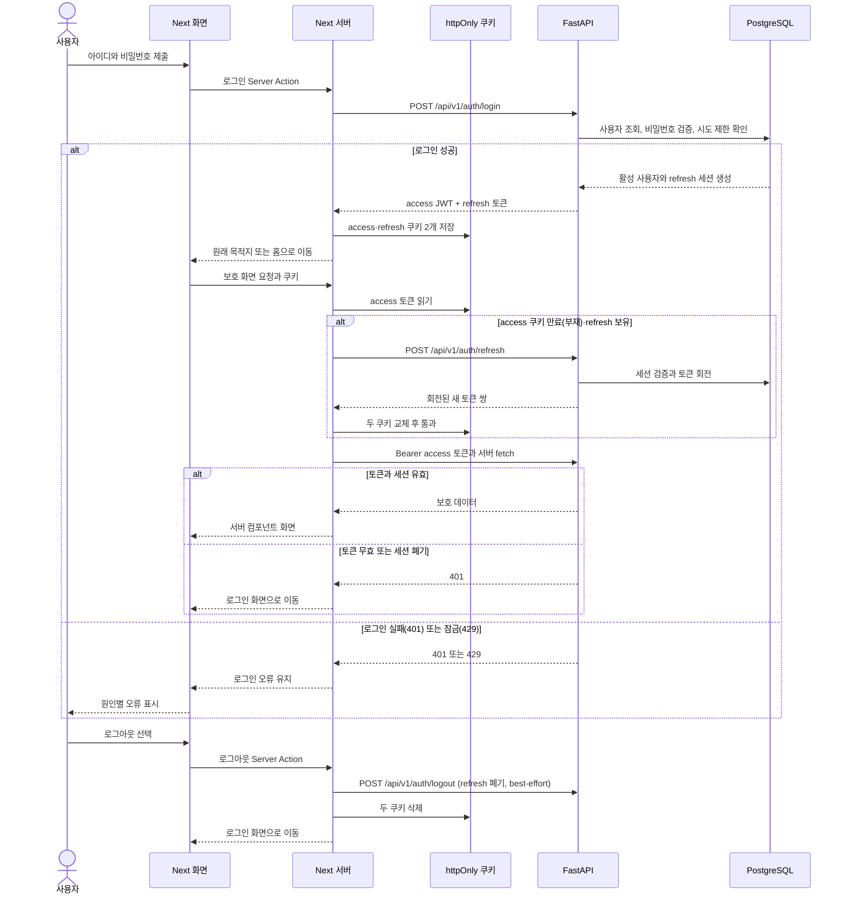
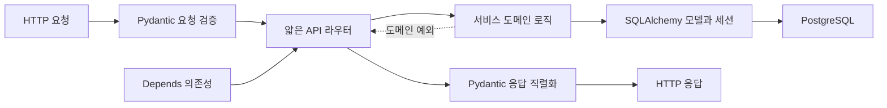
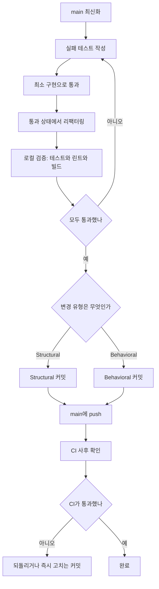

# __PROJECT_NAME__

`fastapi-nextjs-pg-starter`로 생성된 FastAPI · Next.js · PostgreSQL 프로젝트다. 백엔드 API, React Server Components 기반 프론트엔드, JWT 기반 자체 계정 인증, Alembic 마이그레이션과 CI 골격을 함께 제공한다.

## 빠른 시작

### 스캐폴드 생성 직후

스캐폴드가 의존성 설치와 DB 마이그레이션까지 완료했다면 두 터미널에서 서버를 실행한다.

```powershell
# Windows — 터미널 1
cd backend
.\.venv\Scripts\python -m uvicorn app.main:app --reload --port 8000

# Windows — 터미널 2
cd frontend
pnpm dev
```

```bash
# macOS / Linux — 터미널 1
cd backend
./.venv/bin/python -m uvicorn app.main:app --reload --port 8000

# macOS / Linux — 터미널 2
cd frontend
pnpm dev
```

브라우저에서 <http://localhost:3000>에 접속한다.

### 다른 머신에서 clone한 경우

clone한 저장소에는 실제 `.env`와 설치된 의존성이 없다. 다음 순서로 준비한다. 아래 코드 블록은 각각 프로젝트 루트에서 실행하며, `DATABASE_URL`은 먼저 생성했거나 접근 가능한 PostgreSQL 데이터베이스를 가리켜야 한다.

1. 런타임을 확인하고 두 환경 파일을 만든다.

```powershell
# Windows
.\scripts\bootstrap.ps1 -WithPostgres
Copy-Item backend\.env.example backend\.env
Copy-Item frontend\.env.example frontend\.env
```

```bash
# macOS / Linux
./scripts/bootstrap.sh --with-postgres
cp backend/.env.example backend/.env
cp frontend/.env.example frontend/.env
```

2. `backend/.env`의 `DATABASE_URL`과 `SECRET_KEY`를 개발 환경에 맞게 설정한다. `frontend/.env`의 서버 전용 `FASTAPI_URL`도 필요하면 조정한다.
3. 의존성을 설치한다.

```powershell
# Windows
cd backend
python -m venv .venv
.\.venv\Scripts\python -m pip install -r requirements.txt
cd ..\frontend
pnpm install
```

```bash
# macOS / Linux
cd backend
python3 -m venv .venv
./.venv/bin/python -m pip install -r requirements.txt
cd ../frontend
pnpm install
```

4. 서버를 띄우기 전에 마이그레이션을 적용한다.

```powershell
# Windows
cd backend
.\.venv\Scripts\python -m alembic upgrade head
```

```bash
# macOS / Linux
cd backend
./.venv/bin/python -m alembic upgrade head
```

그다음 위의 “스캐폴드 생성 직후” 명령으로 서버를 실행한다. 새로 설치한 런타임이 있다면 PATH 반영을 위해 터미널을 다시 연다.

bootstrap은 **하한을 충족하는 런타임이 이미 있으면 pyenv·fnm 없이 그대로 사용**한다. 버전 관리자는 런타임이 하한에 못 미칠 때만 필요하며, Windows에서 Python이 부족하고 pyenv-win도 없으면 [공식 설치 문서](https://pyenv-win.github.io/pyenv-win/docs/installation.html)를 안내하고 중단한다(자동 설치하지 않는다). 관리자 없이 진행하면 `.python-version`·`.nvmrc` 핀과 실제 버전이 다를 수 있고, CI는 핀 파일을 읽으므로 그 경우 경고를 출력한다.

## 런타임 구조

개발 중 브라우저는 Next.js 개발 서버에 접속하고 httpOnly 쿠키로 세션을 전달하며 FastAPI를 직접 호출하지 않는다. 서버 컴포넌트와 Server Actions는 FastAPI를 서버 사이드 `fetch`로 호출하며 Bearer JWT를 주입한다. Alembic은 애플리케이션 요청 경로와 별도로 DB 스키마를 관리한다. 배포에는 정적 호스팅이 아니라 Node 런타임이 필요하며, `next build` 후 `next start`로 실행한다.



## 인증과 기본 계정

이 프로젝트는 username/password 로그인을 기본 제공한다. FastAPI는 로그인 시 **access JWT(기본 15분)** 와 **DB 세션 기반 refresh 토큰(기본 14일, 불투명 문자열)** 쌍을 발급하고, Next가 이를 httpOnly 쿠키 두 개에 저장한다(운영에서는 `__Host-` 프리픽스). 이후 FastAPI 서버 요청에는 access 토큰을 Bearer로 전달하며, access 쿠키가 만료되면 `middleware.ts`가 refresh 토큰으로 새 쌍을 받아 자동 갱신한다(회전 방식 — 재사용이 감지되면 세션이 폐기된다). 로그아웃은 백엔드에서 refresh 세션을 폐기해 access 토큰도 즉시 무효화한다. 로그인은 계정별 시도 제한(기본 5회 실패 시 15분 잠금, 429)으로 보호되고 보안 이벤트는 `app.audit` 로거에 남는다. 처음 백엔드를 실행할 때 `admin` 계정이 없으면 개발용 관리자 **`admin`** 이 시드된다. 비밀번호는 스캐폴드가 무작위로 생성해 `backend/.env` 의 `DEFAULT_ADMIN_PASSWORD` 에 넣는다.

> [!CAUTION]
> **시드 관리자는 로컬 개발 전용이다. 배포 전 `APP_ENV=production` 으로 두고 `SECRET_KEY` 를 교체하며 `SEED_DEFAULT_ADMIN=false` 로 끈다 — 두 조건을 어기면 백엔드가 기동을 거부한다.** 전체 항목은 [`docs/architecture.md`의 배포 전 체크리스트](docs/architecture.md#배포-전-체크리스트-스타터-기본값-제거--must)를 확인한다.

`middleware.ts`는 access 쿠키가 없고 refresh 쿠키만 있으면 백엔드로 자동 갱신을 시도하고, 둘 다 없거나 갱신이 401이면 `/login`으로 보낸다. 로그인 성공 후에는 검증된 내부 목적지 또는 홈으로 이동시킨다. `users.role`과 백엔드의 `require_admin` 의존성으로 관리자 API를 보호한다. 프론트는 전 경로에 보안 응답 헤더(CSP, `X-Frame-Options: DENY`, nosniff, Referrer-Policy, Permissions-Policy, 운영 HSTS)를 내보낸다(`next.config.ts`).



## 프로젝트 구조와 API 확장

백엔드는 HTTP 처리, 검증, 도메인 로직, 영속성을 분리한다. 새 API의 라우터는 HTTP 입출력과 예외 변환만 담당하고, 업무 로직은 `services/`, 요청·응답 검증은 `schemas/`, 영속 모델은 `models/`에 둔다.



세부 디렉터리와 계층 규칙은 [`docs/architecture.md` §4](docs/architecture.md#4-백엔드-구조backendapp)와 [§8](docs/architecture.md#8-모델--스키마--서비스-규칙)을 따른다.

## 개발 워크플로

`main`에서 TDD의 Red → Green → Refactor 순서로 진행하고 바로 커밋·push 한다. 브랜치와 PR은 선택이다. Structural과 Behavioral 변경은 한 커밋에 섞지 않는다.

⛔ **push 전 로컬 검증이 유일한 게이트다.** PR 리뷰 단계가 없으므로 검증을 건너뛰면 깨진 코드가 곧바로 `main`에 남는다. CI는 push 이후 도는 사후 안전망이다.



되돌리기 어렵거나 광범위한 변경, 중간 상태를 `main`에 두고 싶지 않을 때, 리뷰가 필요할 때는 브랜치를 따고 PR을 만든다. 협업자가 생기면 `main` 브랜치 보호와 필수 CI 검사를 켜고 PR 흐름을 기본으로 되돌리는 것을 권장한다. 상세 규칙은 [`docs/architecture.md` §18~§20](docs/architecture.md#18-개발-원칙-tdd--tidy-first)에 있다.

## DB 마이그레이션

DB 스키마는 Alembic으로만 변경한다. 자동 생성 결과를 검토한 뒤 적용하고, 런타임 `create_all`이나 수동 `ALTER`로 우회하지 않는다.

```powershell
# Windows
cd backend
.\.venv\Scripts\python -m alembic revision --autogenerate -m "변경요약"
.\.venv\Scripts\python -m alembic upgrade head
```

```bash
# macOS / Linux
cd backend
./.venv/bin/python -m alembic revision --autogenerate -m "변경요약"
./.venv/bin/python -m alembic upgrade head
```

자세한 검토와 롤백 원칙은 [`docs/architecture.md` §11](docs/architecture.md#11-마이그레이션-alembic---must-db는-항상-alembic으로-관리)을 참고한다.

## 테스트와 품질 검사

로컬에서도 CI와 같은 순서로 검사한다.

```powershell
# Windows
cd backend
.\.venv\Scripts\python -m ruff check .
.\.venv\Scripts\python -m pytest -q
cd ..\frontend
pnpm lint
pnpm typecheck
pnpm test
pnpm build
```

```bash
# macOS / Linux
cd backend
./.venv/bin/python -m ruff check .
./.venv/bin/python -m pytest -q
cd ../frontend
pnpm lint
pnpm typecheck
pnpm test
pnpm build
```

`.github/workflows/ci.yml`은 push와 `main` 대상 PR에서 백엔드의 ruff → pytest(Ubuntu·Windows 매트릭스), Alembic 검증(`migrations` — 서비스 컨테이너가 Linux 러너에서만 뜨므로 Ubuntu 전용), `.ps1` 구문 검사(`powershell-syntax` — Windows PowerShell 5.1), 프론트엔드의 ESLint → typecheck → test(Vitest) → build를 실행한다. 의존성 취약점 스캔(`backend-audit`의 pip-audit, `frontend-audit`의 `pnpm audit --prod`)은 경고성 잡이다 — 실패해도 워크플로는 초록이므로 로그의 경고 표시를 주기적으로 확인한다.

## 환경 설정

- 백엔드는 `backend/.env.example`을 복사한 `backend/.env`를 사용한다. `DATABASE_URL`, `SECRET_KEY`, CORS, 토큰 만료 시간과 기본 관리자 시드를 여기서 설정한다.
- 프론트엔드는 `frontend/.env.example`을 복사한 `frontend/.env`를 사용한다. 서버에서 FastAPI를 호출할 주소는 서버 전용 `FASTAPI_URL`로 설정한다.
- ⛔ 서버 전용 값에 `NEXT_PUBLIC_`을 붙이면 클라이언트 번들에 값이 포함되므로 남용하지 않는다.
- 실제 `.env` 파일은 커밋하지 않는다. 배포 전에는 위 기본 계정 경고와 [`docs/architecture.md` §21](docs/architecture.md#21-신규-프로젝트-부트스트랩-체크리스트)을 다시 확인한다.
- Unix 계열은 `TZ=Asia/Seoul`을 프로세스 시각대에 적용한다. Windows는 OS 시각대를 서울(UTC+9)로 설정해야 하며, 불일치하면 애플리케이션이 경고한다.

## 기술 스택과 버전

버전 표기는 영역마다 의미가 다르다. 아래 표의 **고정 방식** 열을 먼저 본다.

| 표기 | 의미 |
|---|---|
| `≥ X` | **하한**. 이상이면 기존 설치본을 그대로 재사용하고, 미만이거나 없을 때만 설치한다. |
| `== X.Y.Z` | **정확 고정**. 재현성 우선 — 다른 버전이 설치되지 않는다. |
| `^X.Y.Z` | major 고정, minor·patch 상승 허용 (`>=X.Y.Z <X+1.0.0`). **단 `0.x`는 minor까지 고정** (`^0.5.3` = `>=0.5.3 <0.6.0`). |
| `~X.Y.Z` | major·minor 고정, patch만 상승 허용 (`>=X.Y.Z <X.Y+1.0`). |

### 런타임

하한과 실제 설치 핀이 따로 있다. 하한은 bootstrap이 재사용 여부를 판단할 때 쓰고, 핀은 pyenv·fnm·corepack·CI가 실제로 설치·활성화하는 버전이다.

| 항목 | 하한 | 실제 설치 핀 | 핀 출처 |
|---|---|---|---|
| Python | ≥ 3.13 | `3.13.14` 정확 고정 | [`.python-version`](.python-version) — pyenv가 이 버전을 설치 |
| Node.js | ≥ 24 | `24` major 고정 | [`.nvmrc`](.nvmrc) — fnm이 24.x 최신을 설치 |
| pnpm | ≥ 11 | `11.9.0` 정확 고정 | [`frontend/package.json`](frontend/package.json)의 `packageManager` — corepack이 활성화 |
| PostgreSQL | 고정 없음 | — | `psycopg2-binary` 지원 범위(14+ 권장). CI는 `postgres:16` 사용 |

하한은 [`scripts/versions.env`](scripts/versions.env)가 SSOT다(`MIN_PYTHON`·`MIN_NODE`·`MIN_PNPM`).

### 백엔드 — 전부 `==` 정확 고정

재현성을 우선한다. ⛔ 임의 `pip install -U` 금지 — 상향은 `stack-versions` 스킬의 검증 절차를 따른다. SSOT는 [`backend/requirements.txt`](backend/requirements.txt).

| 패키지 | 고정 버전 | 패키지 | 고정 버전 |
|---|---|---|---|
| fastapi | `== 0.137.2` | bcrypt | `== 4.3.0` |
| uvicorn[standard] | `== 0.49.0` | python-multipart | `== 0.0.32` |
| sqlalchemy | `== 2.0.51` | httpx2 | `== 2.5.0` |
| alembic | `== 1.18.5` | pytest | `== 9.1.1` |
| psycopg2-binary | `== 2.9.12` | ruff | `== 0.14.0` |
| pydantic | `== 2.13.4` | | |
| pydantic-settings | `== 2.14.2` | | |
| PyJWT | `== 2.13.0` | | |

### 프론트엔드

실제로 설치하고 lint · typecheck · test · build를 모두 통과한 뒤 버전을 확정한다. SSOT는 [`frontend/package.json`](frontend/package.json).

| 런타임 의존성 | 범위 | 개발 의존성 | 범위 |
|---|---|---|---|
| Next.js | `16.3` | TypeScript | `6.0` |
| React | `19.2` | Tailwind CSS | `4.3` |
| | | @tailwindcss/postcss | `4.3` |
| | | ESLint | `9.39` |
| | | Vitest | `4.1` |
| | | @testing-library/react | `16.3` |

## 상세 문서

- [`docs/architecture.md`](docs/architecture.md): 이 프로젝트의 아키텍처, MUST 규칙과 배포 전 체크리스트
- [`plan.md`](plan.md): TDD 작업 순서와 기능별 체크리스트
- [`CLAUDE.md`](CLAUDE.md): 저장소 안에서 자립적으로 동작하는 AI 개발 지침
- [`.claude/skills/`](.claude/skills/): 백엔드 도메인, 마이그레이션, 프론트 기능, PR과 버전 작업을 위한 선택적 작업별 가이드
